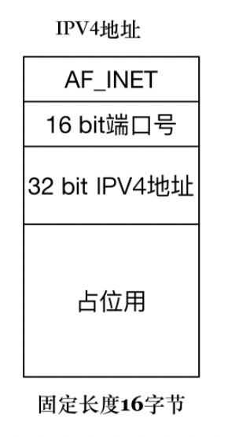

## 学习高性能网络编程，掌握两个核心要点

* 第一就是理解网络协议，并在这个基础上和操作系统内核配合，感知各种网络 I/O 事件；
* 第二就是学会使用线程处理并发。

## 客户端 - 服务器网络编程模型

* 网络模型

    

* 通信过程

* 客户端和服务器工作的核心逻辑

**讲述高性能网络编程的目的：如何保证服务器端在数据量巨大的客户端访问时依然能维持效率和稳定。**

## 套接字

### 通用套接字地址格式

```c
typedef unsigned short int sa_family_t;
/* 描述通用套接字地址 */
struct sockaddr{ 
    sa_family_t sa_family; /* 地址族. 16-bit*/ 
    char sa_data[14]; /* 具体的地址值 112-bit */ 
};
```

* 第一个字段是地址族

    * AF_LOCAL：表示的是本地地址，对应的是 Unix 套接字。

        这种情况一般用于本地 socket 通信，很多情况下也可以写成 AF_UNIX、AF_FILE。

    * AF_INET：因特网使用的 IPv4 地址。

    * AF_INET6：因特网使用的 IPv6 地址。

### IPv4 套接字格式地址

```c
/* IPV4套接字地址，32bit值. */
typedef uint32_t in_addr_t;
struct in_addr { 
    in_addr_t s_addr; 
};

/* 描述IPV4的套接字地址格式 */
struct sockaddr_in { 
    sa_family_t sin_family; /* 16-bit */ 
    in_port_t sin_port; /* 端口 16-bit*/ 
    struct in_addr sin_addr; /* Internet address. 32-bit */
    unsigned char sin_zero[8]; /* 这里仅仅用作占位符，不做实际用处 */  
};
```



## 服务端准备连接过程

### socket 创建套接字

```c
int socket(int domain, int type, int protocol)
```

* domain 表示套接字：PF_INET、PF_INET6、PF_LOCAL
* type 表示套接字类型：
    * SOCK_STREAM: 表示的是字节流，对应 TCP；
    * SOCK_DGRAM： 表示的是数据报，对应 UDP；
    * SOCK_RAW: 表示的是原始套接字。
* protocol 原本是用来指定通信协议的，但现在基本废弃。目前一般写成 0 即可。

### bind 绑定地址

```c
bind(int fd, sockaddr * addr, socklen_t len)
```

* addr 表示地址
    * 第二个参数是通用地址格式 sockaddr * addr
    * 实际上传入的参数可能是 IPv4、IPv6 或者本地套接字格式
    * 根据 len 字段判断传入的参数 addr 该怎么解析
* len 字段表示传入的地址长度，它是一个可变值

#### 通配地址

* 问题

    * 不清楚自己的应用程序将会被部署到哪台机器上
    * 一台机器有多块网卡

* 利用通配地址

    ```c
    struct sockaddr_in name;
    name.sin_addr.s_addr = htonl(INADDR_ANY); /* IPV4通配地址 */
    ```

#### 随机端口

* 如果把端口设置成 0，就相当于把端口的选择权交给操作系统内核来处理，操作系统内核会根据一定的算法选择一个空闲的端口，完成套接字的绑定

### listen 监听连接

```c
int listen (int socketfd, int backlog)
```

* socketdf 为套接字描述符
* backlog
    * 在 Linux 中表示已完成 (ESTABLISHED) 且未 accept 的队列大小，这个参数的大小决定了可以接收的并发数目
    * 但是参数过大也会占用过多的系统资源，Linux 并不允许对这个参数进行改变

### accept 接收连接

 ```c
int accept(int listensockfd, struct sockaddr *cliaddr, socklen_t *addrlen)
 ```

* listensockfd 是 listen 套接字，即通过 bind，listen 一系列操作而得到的套接字
* 参数返回值
    * cliaddr 是通过指针方式获取的客户端的地址
    * addrlen 是客户端地址的大小
* 函数返回值
    * 全新的套接字，代表了与客户端的连接

#### 两个套接字

* 第一个是监听套接字描述字 listensockfd，作为输入参数
    * 监听套接字必须一直都存在，它需要监听新的客户端的连接，直到这个监听套接字关闭。
* 第二个是返回的已连接套接字描述字
    * 一旦一个客户和服务器连接成功，完成了 TCP 三次握手，操作系统内核就为这个客户生成一个已连接套接字，让应用服务器使用这个已连接套接字和客户进行通信处理。
    * 如果应用服务器完成了对这个客户的服务，那么关闭的就是已连接套接字，这样就完成了 TCP 连接的释放。
    * 注意：这里释放的只是这一个客户连接，其它连接的客户连接还存在。

## 客户端发起过程

### connect 连接

```c
int connect(int sockfd, const struct sockaddr *servaddr, socklen_t addrlen)
```

* sockfd 是连接套接字，socket 函数创建
* servaddr 是指向套接字地址结构的指针
    * 必须含有服务器的 IP 地址和端口号
* addrlen 是指向套接字地址结构的大小

#### 临时端口

* 调用函数 connect 前不必非得调用 bind 函数，内核会确定源 IP 地址，并按照一定的算法选择一个临时端口作为源端口。

#### 出错情况

调用 connect 函数将激发 TCP 的三次握手过程，而且仅在连接建立成功或出错时才返回。

* 三次握手无法建立，客户端发出的 SYN 包没有任何响应，于是返回 TIMEOUT 错误。
    * 比较常见的原因是对应的服务端 IP 写错。

* 客户端收到了 RST（复位）回答，这时候客户端会立即返回 CONNECTION REFUSED 错误。
    * 比较常见于客户端发送连接请求时的请求端口写错，因为 RST 是 TCP 在发生错误时发送的一种 TCP 分节。
    * 产生 RST 的三个条件是：
        * 目的地为某端口的 SYN 到达，然而该端口上没有正在监听的服务器
        * TCP 想取消一个已有连接；
        * TCP 接收到一个根本不存在的连接上的分节。
* 客户发出的 SYN 包在网络上引起了"destination unreachable"，即目的不可达的错误。
    * 比较常见的原因是客户端和服务器端路由不通

#### 三次握手过程


## 事件驱动模型

* 反应堆模型（reactor）、Event loop 模型

* 模型的两点核心

    * 它存在一个无限循环的事件分发线程，叫做 reactor 线程、Event loop 线程。（poll、epoll 等 I/O 分发技术的使用）

    * 所有的 I/O 操作都可以抽象成事件，每个事件必须有回调函数来处理。

        acceptor 上有连接建立成功、已连接套接字上发送缓冲区空出可以写、通信管道 pipe 上有数据可以读，

        这些都是一个个事件，通过事件分发，这些事件都可以一一被检测，并调用对应的回调函数加以处理。

## I/O 模型和线程模型设计

### 网络程序执行过程

* read：从套接字收取数据；
* decode：对收到的数据进行解析；
* compute：根据解析之后的内容，进行计算和处理；
* encode：将处理之后的结果，按照约定的格式进行编码；
* send：通过套接字把结果发送出去。

### fork

* 使用 fork 来创建子进程，为每个到达的客户连接服务。
* 随着客户数的变多，fork 的子进程也越来越多，即使客户和服务器之间的交互比较少，这样的子进程也不能被销毁，一直需要存在。
* 使用 fork 的方式处理非常简单，它的缺点是处理效率不高，fork 子进程的开销太大。

### pthread

* 使用了 pthread_create 创建子线程，因为线程是比进程更轻量级的执行单位。
* 预先创建出一个线程池，在每次新连接达到时，从线程池挑选出一个线程为之服务，很好地解决了线程创建的开销。
* 还是没有解决空闲连接占用资源的问题，如果一个连接在一定时间内没有数据交互，这个连接还是要占用一定的线程资源，直到这个连接消亡为止。

### single reactor thread

